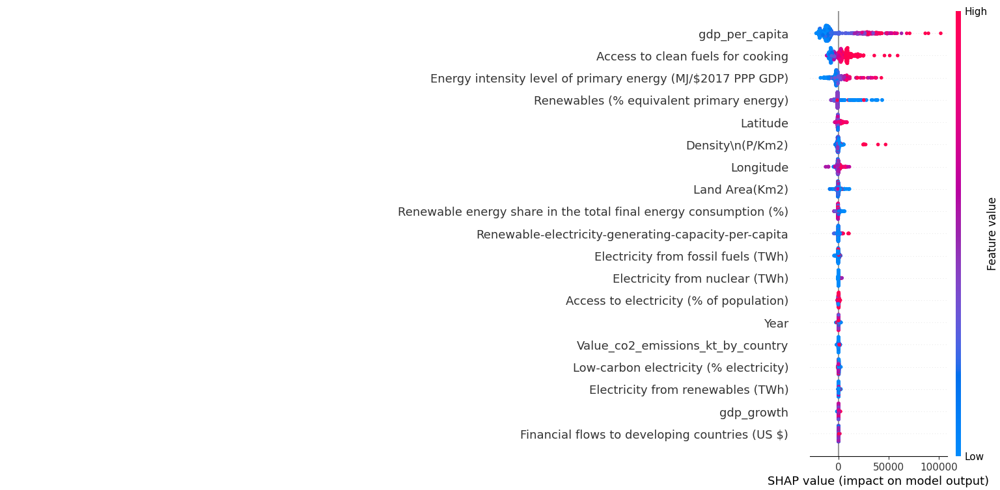
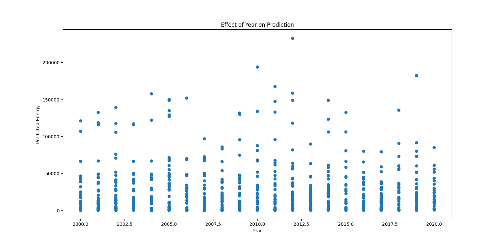
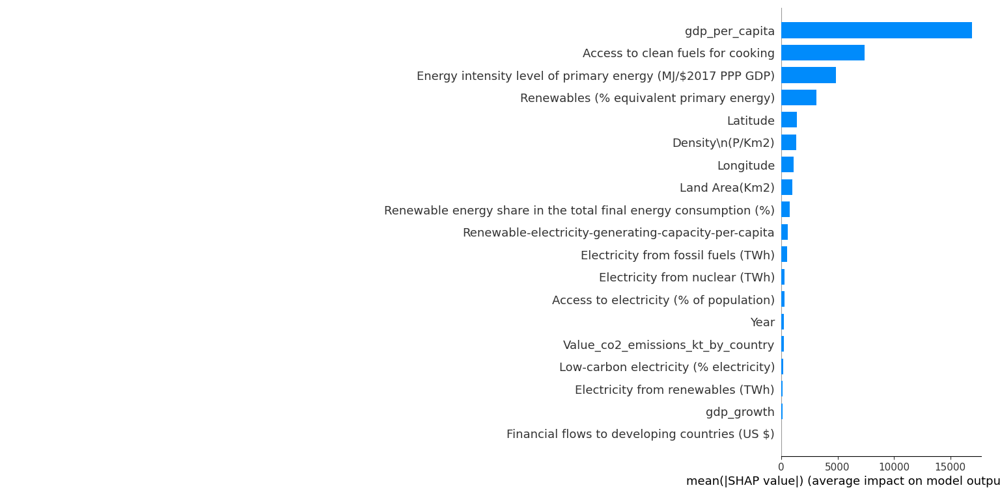
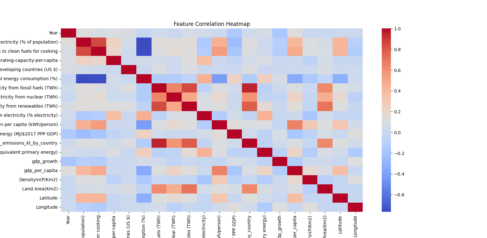
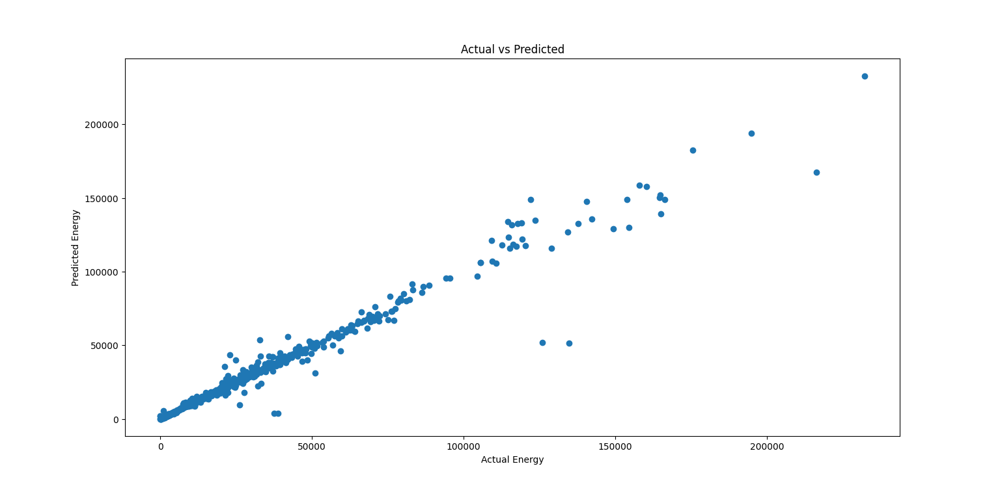
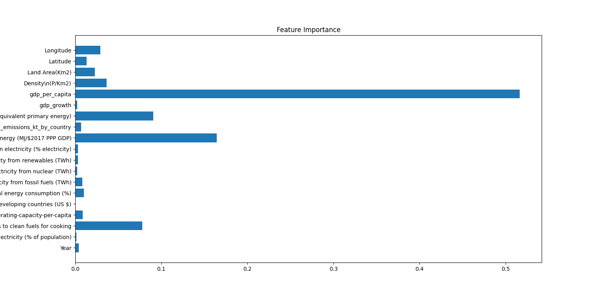

# Smart Energy Optimization System for Buildings

[](https://www.python.org/)
[](https://blh4aiynjiyr5u9drsyejz.streamlit.app/)
[]()

## Live Application

Access the deployed application here:  
https://blh4aiynjiyr5u9drsyejz.streamlit.app/

---

## Overview

The Smart Energy Optimization System is a data-driven application designed to analyze global energy consumption patterns and predict renewable energy trends. It integrates machine learning, time series forecasting, and explainable AI techniques into an interactive web interface.

The system allows users to upload datasets, train predictive models, visualize trends, and interpret results with transparency.

---

## Features

### Predictive Modeling
- Train a machine learning model to estimate renewable energy share
- Interactive input interface for real-time predictions
- Based on Random Forest regression

### Performance Evaluation
- Displays Mean Squared Error (MSE)
- Displays R² Score
- Compares actual vs predicted values visually

### Time Series Analysis
- Visualizes historical energy trends
- Applies rolling average smoothing
- Forecasts future values using ARIMA

### Energy Insights
- Identifies peak energy usage
- Computes average consumption
- Helps detect patterns and irregularities

### Explainable AI
- SHAP for global feature importance
- LIME for local prediction interpretation
- Enhances model transparency and trust

---

## Technology Stack

- Frontend: Streamlit  
- Data Processing: Pandas, NumPy  
- Machine Learning: Scikit-learn  
- Time Series Forecasting: Statsmodels (ARIMA)  
- Visualization: Plotly, Matplotlib, Seaborn  
- Explainability: SHAP, LIME  

---

## Dataset

The application uses a global sustainable energy dataset containing:

- Renewable energy metrics  
- Electricity generation data  
- CO₂ emissions  
- GDP and population statistics  
- Link: https://www.kaggle.com/datasets/anshtanwar/global-data-on-sustainable-energy/data
---
## Screenshot








---
## Use Cases
- Smart building energy management
- Sustainability and policy analysis
- Academic and research projects
- Data science portfolios

---
## Contributing

Contributions are welcome. Please fork the repository and submit a pull request for review.

---
## Installation

Clone the repository:

```bash
git clone https://github.com/your-username/your-repo-name.git
cd your-repo-name
